# ⚙️ QUILAB — Arquitectura y Stack Tecnológico

#quilab #stack #laravel #react #typescript #vite #tailwind #git

* **Hub Principal:** [[QUILAB - Hub del Proyecto]]
* **Relacionado:** [[QUILAB - Seguridad y Acceso Admin (WPS Hide Login)]] | [[QUILAB - Creative Studio y Shaders]]

---

## 🏗️ Resumen del Stack

```mermaid
graph LR
    subgraph Frontend["Frontend SPA"]
        React["React 19 + TypeScript"]
        Tailwind["Tailwind CSS v4"]
        OGL["OGL WebGL Shaders"]
        Router["React Router v7"]
    end

    subgraph Backend["Backend API"]
        Laravel["Laravel 12"]
        Sanctum["Sanctum SPA Auth"]
        Eloquent["Eloquent ORM"]
        RateLimit["Rate Limiter Middleware"]
    end

    subgraph Infra["Infraestructura & Servidor"]
        Apache["Apache (XAMPP / Hostinger)"]
        Base["Subdirectorio /quilab"]
        Git["GitHub AndresDj06/quilab"]
    end

    Frontend <-->|JSON / Axios con CSRF| Backend
    Backend <--> Infra
```

---

## 💻 Frontend
* **Core:** React 19, TypeScript, Vite.
* **Estilos:** Tailwind CSS v4 con variables CSS personalizadas (`@theme`).
* **Iconografía:** Lucide React (`lucide-react`).
* **Librerías gráficas:** `ogl` (WebGL ligero de alta velocidad para shaders interactivos).
* **Enrutamiento:** React Router con soporte dinámico para subdirectorios mediante `<meta name="app-basename">`.

---

## 🛡️ Backend
* **Framework:** Laravel 12.
* **Autenticación:** Laravel Sanctum (Sesión basada en cookies seguras HTTP-only y tokens CSRF automáticos).
* **Políticas:** Policies para `Project`, `Member`, `User` y `ContactMessage`.
* **Rutas API:**
  * Públicas: `/api/public/landing`, `/api/public/projects`, `/api/public/members`, `/api/public/contact`.
  * Administrativas (protegidas con `auth:sanctum`): `/api/admin/*`.

---

## 🚀 Entorno Local y Producción
* **Ruta de desarrollo:** `c:\xampp\htdocs\quilab`
* **URL local:** `http://localhost/quilab/`
* **Subdirectorio:** Gestionado automáticamente por `detectWebBase()` en `AppServiceProvider.php` y compartido en la vista Blade principal (`app.blade.php`).
* **Compilación:** `npm run build` genera los bundles optimizados en `public/build/`.
* **Repositorio Remoto:**  
  `https://github.com/AndresDj06/quilab.git` (ramas: `main` y `estilo-anterior`).

---
*Vinculado en:* [[QUILAB - Hub del Proyecto]] | [[QUILAB - Seguridad y Acceso Admin (WPS Hide Login)]]
