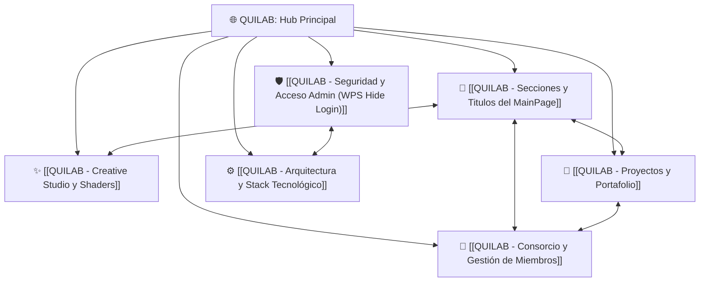

# 🌐 QUILAB — Hub Principal del Proyecto (MOC)

#quilab #consorcio #software-architecture #hub #reactbits #laravel

> **QUILAB** es un consorcio de ingeniería de software de alto nivel, arquitectura escalable y soluciones digitales de misión crítica. Este documento sirve como **Mapa de Contenido (Map of Content - MOC)** interconectando todos los módulos, guías de diseño, credenciales, seguridad y especificaciones técnicas en Obsidian.

---

## 🗺️ Mapa de Contenido Interconectado (Graph Hub)

---

## 📑 Índice de Temas Vinculados

### 1. 🖥️ Diseño y Estructura del Frontend
* [[QUILAB - Secciones y Titulos del MainPage]]
  * Desglose completo de cada `div`, sección y título en `http://localhost/quilab/`.
  * **Hero Principal**: Titular rotativo `VaporType`, matriz `HeroGrid`, logo interactivo `<quilab>`.
  * **Métricas**: Tarjetas Liquid Glass reflectantes (`Plataformas & Apps`, `Consorcio Activo`, `Entregas en Producción`, `Años de Trayectoria`).
  * **Casos & Proyectos**: Rejilla de doble vagón con fondo `DarkVeil`.
  * **El Consorcio & Metodología**: Pilares y framework ágil de 4 fases.
  * **Capacidades Técnicas**: Catálogo de 8 servicios especializados.
  * **Talento & Squads**: Fichas de ingenieros senior con proyectos verificados.
  * **Contacto & Formulario**: Captura de requerimientos y cotizaciones.

### 2. 🔐 Seguridad, Credenciales y Acceso Admin
* [[QUILAB - Seguridad y Acceso Admin (WPS Hide Login)]]
  * Mecanismo de camuflaje de ruta administrativa estilo **WPS Hide Login**.
  * **Ruta de acceso directa:** `http://localhost/quilab/acceso-consorcio` (configurable en `.env`).
  * Trampas de redirección automática para escaneos no autorizados en `/login`, `/wp-login` y `/admin`.
  * **Credenciales maestras:** SuperAdmin, Admin y Editor.
  * Pantalla de login cinematográfica con shader WebGL `<PlasmaWave />`.

### 3. 🎨 Creative Studio & Laboratorio React Bits
* [[QUILAB - Creative Studio y Shaders]]
  * Estudio interactivo en `/admin/creative` al estilo *reactbits.dev*.
  * Controladores deslizantes en 3 columnas para ajuste de shaders en tiempo real.
  * **Shaders y Efectos activos:**
    * `<DarkVeil />`: Lienzo procedural WebGL con CPPN, sigmoid math y scanlines.
    * `<PlasmaWave />`: Ondas sinusoidales con distorsión focal y bicromía.
    * `<GlowCursor />`: Puntero reactivo con estela luminosa y trailing de color.
    * `<VaporType />`: Condensación y evaporación física de texto.
    * `<HeroGrid />`: Red paramétrica de nodos y coordenadas interactivas.
    * `<TechText />`: Dispersión de partículas cinéticas con micro-guiones.
    * `<SpecularButton />`: Botones con destello especular y bisel reflectante.

### 4. 🚀 Proyectos, Casos de Estudio y Modal Cards
* [[QUILAB - Proyectos y Portafolio]]
  * Sistema de portafolio con arquitectura de **2 vagones por fila**.
  * Componente **Modal Cards** de React Bits Pro: Tarjetas que se expanden fluidamente en modales de pantalla completa.
  * Modelado en base de datos (`projects`), tags tecnológicos, estados de producción y enlaces a repositorios / demos.

### 5. 👥 Consorcio, Squads y Gestión de Miembros
* [[QUILAB - Consorcio y Gestión de Miembros]]
  * Gestión administrativa de ingenieros y especialistas técnicos (`/admin/miembros`).
  * Asignación de roles: Líder de Ingeniería, Arquitecto Cloud, Full-Stack, etc.
  * **Métricas dinámicas:** Cálculo automático de proyectos entregados por miembro.

### 6. 🛠️ Arquitectura, Base de Datos y Stack Técnico
* [[QUILAB - Arquitectura y Stack Tecnológico]]
  * **Backend**: Laravel 12, Sanctum Auth, SQLite / MySQL, Eloquent ORM.
  * **Frontend**: React 19, TypeScript, Tailwind CSS v4, Lucide Icons, OGL WebGL.
  * **Infraestructura**: Compatible con XAMPP (Apache local en `/quilab`) y Hostinger VPS / cPanel.
  * **Control de versiones**: Sincronizado en GitHub (`https://github.com/AndresDj06/quilab.git`) en ramas `main` y `estilo-anterior`.

---

## 🔗 Accesos Rápidos Locales

| Entorno / Página          | URL Local                                    | Descripción                                   |
| :------------------------ | :------------------------------------------- | :-------------------------------------------- |
| **Portal Público (Home)** | `http://localhost/quilab/`                   | Landing page completa del consorcio           |
| **Catálogo de Proyectos** | `http://localhost/quilab/proyectos`          | Fichas completas de casos y arquitecturas     |
| **Squad de Ingeniería**   | `http://localhost/quilab/equipo`             | Directorio del equipo técnico                 |
| **Login Seguro (WPS)**    | `http://localhost/quilab/acceso-consorcio`   | Acceso con shader PlasmaWave                  |
| **Panel Dashboard**       | `http://localhost/quilab/admin`              | Consola de administración general             |
| **Creative Studio**       | `http://localhost/quilab/admin/creative`     | Inspector interactivo de shaders React Bits   |
| **Gestión de Proyectos**  | `http://localhost/quilab/admin/proyectos`    | Altas, bajas y edición de proyectos           |
| **Gestión de Miembros**   | `http://localhost/quilab/admin/miembros`     | Administración de especialistas y perfiles    |

---
*Bóveda de Obsidian — QUILAB. Para agregar nuevas notas vinculadas usa la sintaxis `[[Nombre de Nota]]`.*
